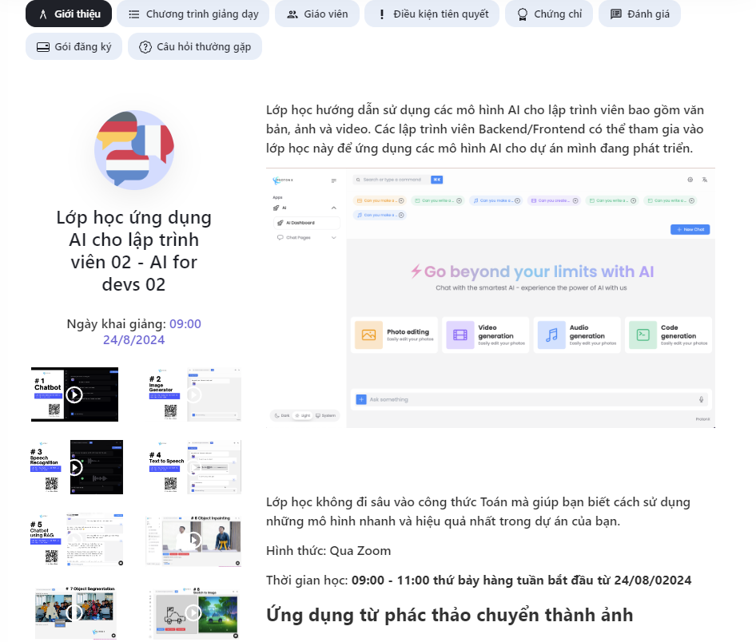

# AI for Devs Course Assignment by ProtonX



## Repository Structure
The repository consists of the following sections:

- Root Directory
  - assignment1
  - assignment2
  - ProtonX-app-UI

To run the application, please choose a function in one of the assignments and connect it to the frontend, which is built and deployed using Next.js.

## How to Run

### Frontend
First, navigate to the frontend directory:
```bash
cd path_to_frontend
npm i  # Install npm dependencies before running this command
```
```bash
#backend
cd path to assignment
python file_name.py
python testfile_name.py
```